

### Overview of this personal project
This case study focuses on addressing the challenges faced by **employees working in big cities**, such as **unorganized parking systems and time-consuming searches**. The solution entails a mobile app designed to optimize employees’ parking experiences by **improving parking efficiency, enhancing user convenience, and providing real-time parking information.** 

### Understanding the problem
Based on my primary research, I've made two **user personas.**

User Persona 1

 
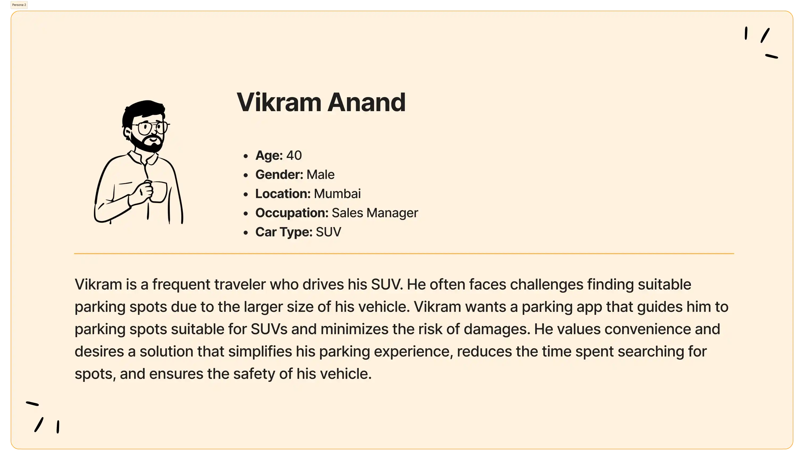
User Persona 2

#### Defining  the problems
Based on the my primary research, I found three primary issues to be addressed.

- Employees **struggle to find empty parking spots** during busy hours. This causes delays, frustration, and reduced productivity.

- **Unauthorized parking**, whether by employees or visitors, worsens the shortage of designated parking spaces for employees.

- Additionally, the frequent use of **car alarms** in parking lots creates **excessive noise** in the vicinity of the office area.

### Ideation and Design Process
#### By fulfiling the below project goals, we can address the primary concerns

Project Goals

#### User Flow

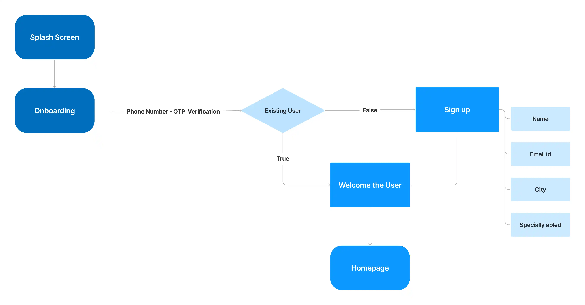
User Flow - Signin

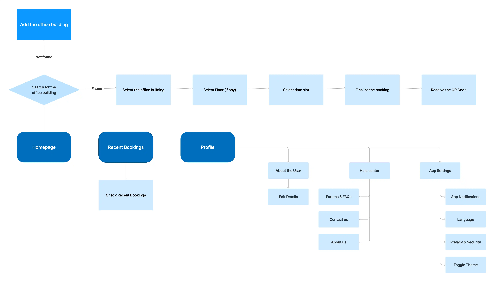
User Flow - Main Flow

#### Digital Wireframes

Before diving into crafting polished designs, I've rapidly **brainstormed** some sleek, **low-fidelity wireframes** to lay the groundwork.

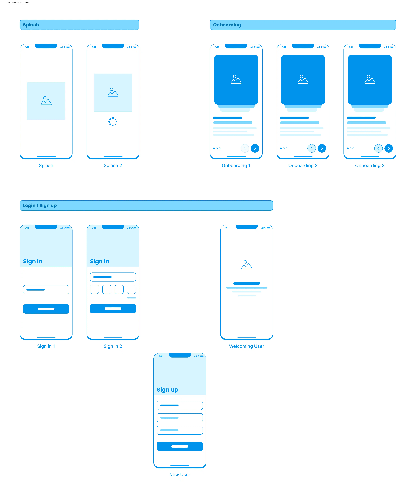
Wireframes - Onboarding

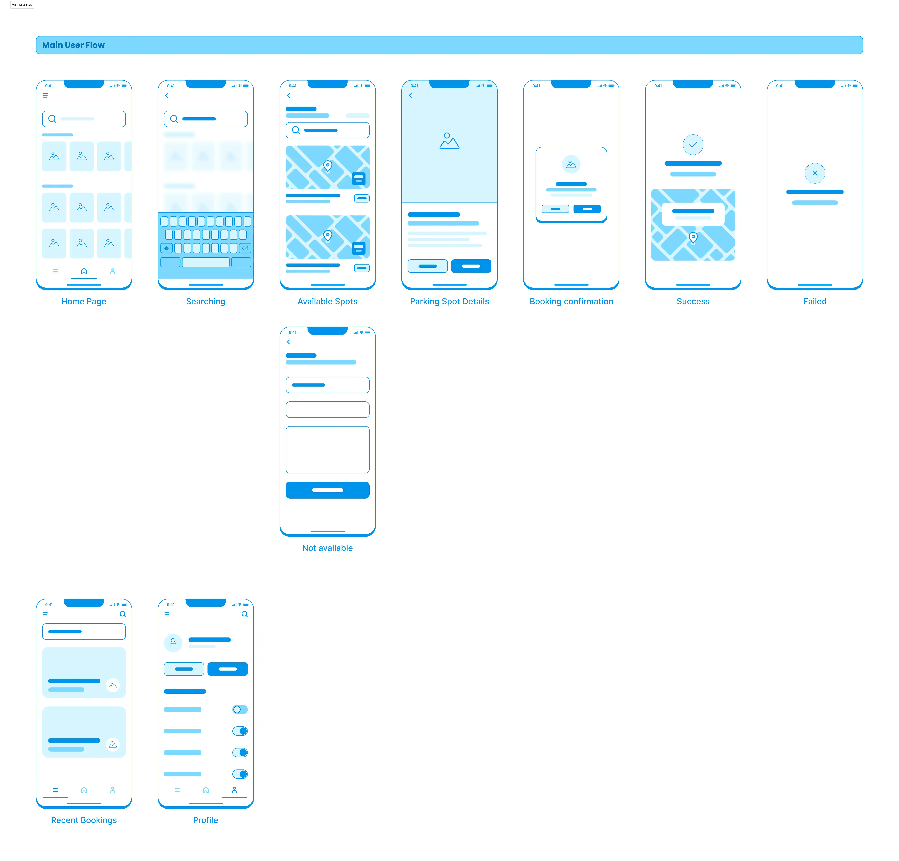
Wireframes - Main

### Design Solution 

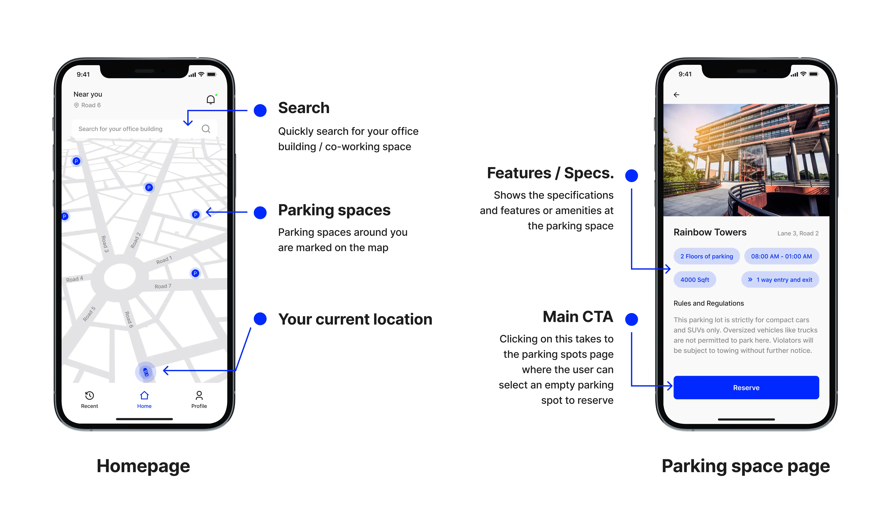

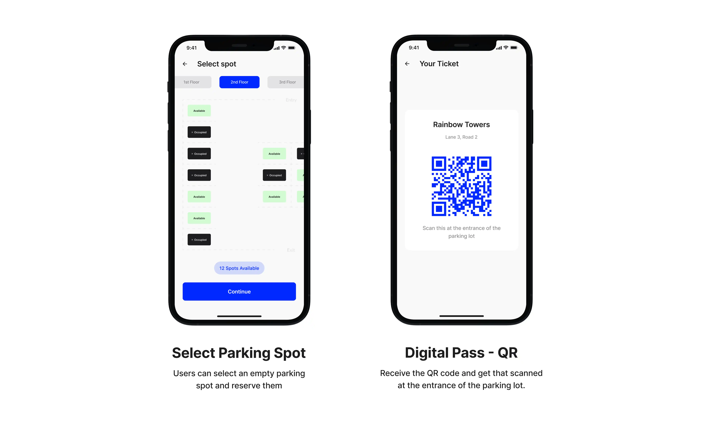

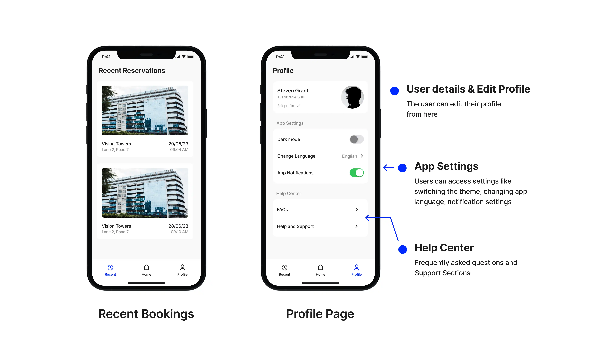

#### Design System

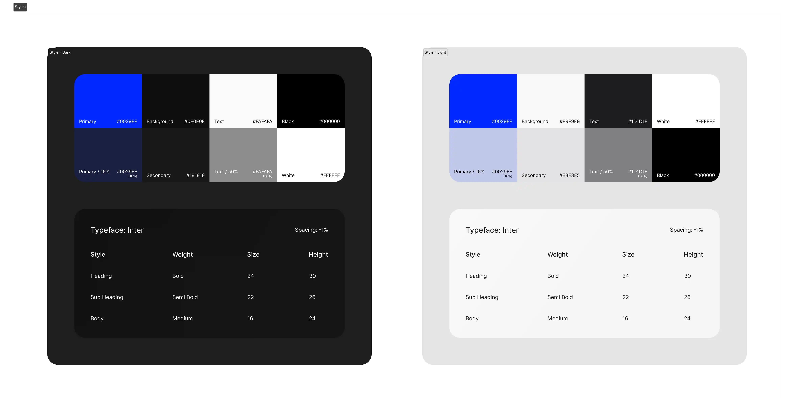
Style Guide

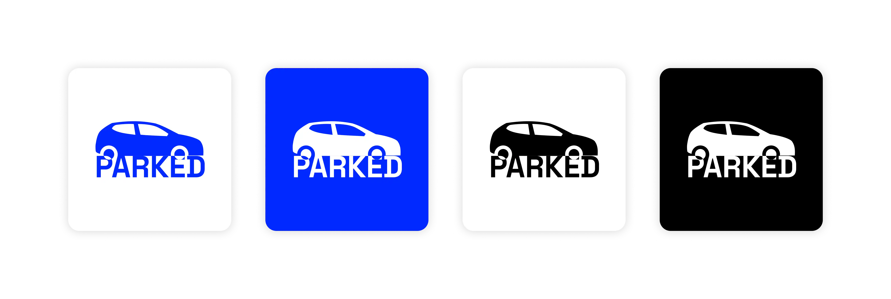
Logo

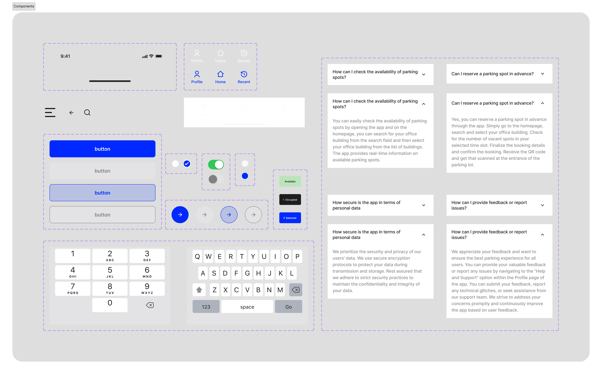
Components

### Final Designs

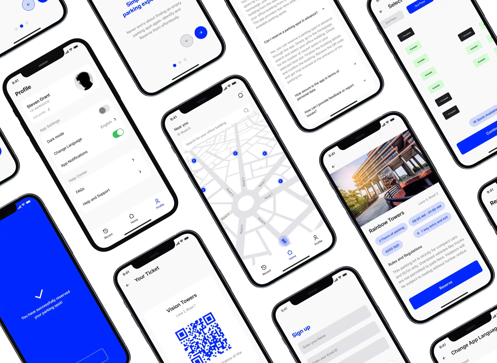
Mockups - Light

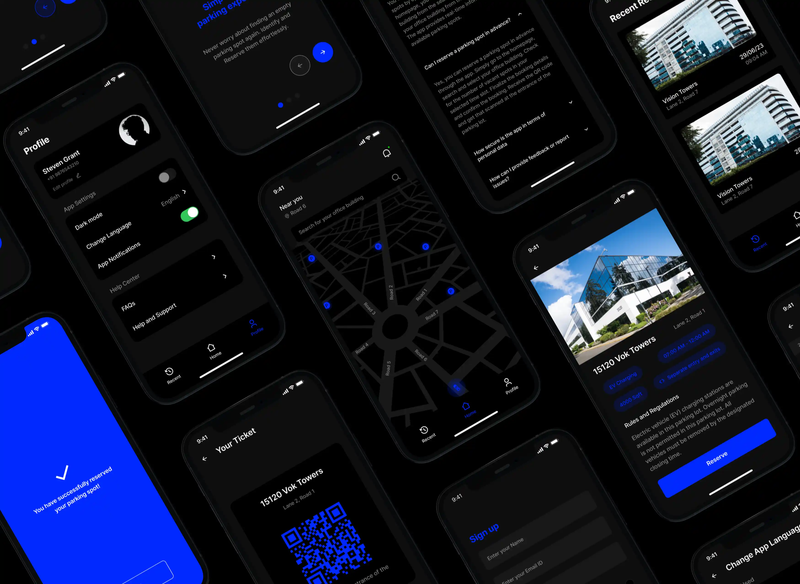
Mockups - Dark

#### Live Prototype
**Press R** to reload the figma embed. Use fullscreen for a better experience

<iframe class="hidden md:inline-flex" style="border: 1px solid rgba(0, 0, 0, 0.1);" width="100%" height="750" src="https://www.figma.com/embed?embed_host=share&url=https%3A%2F%2Fwww.figma.com%2Fproto%2FTkMNXHhtCYDQDaAmnmeTcL%2Fparked%3Fnode-id%3D382-8464%26t%3DfPBFWgog63QchWan-1%26scaling%3Dscale-down%26page-id%3D382%253A8073%26starting-point-node-id%3D382%253A8076%26show-proto-sidebar%3D1" allowfullscreen></iframe>

###  Scope for possible improvements

<strong>Registering with car details</strong> - The users can be asked to register their car details at sign-up. This allows us to recommend more suitable parking spots according to their vehicles.

<strong>‍Paid parking system</strong> - Currently, the app is limited to managing parking in office buildings. However, we could develop the app further to make it accessible to the general public. This would allow building owners to list their available parking spaces and allow drivers to park their vehicles. By doing so, both parties can benefit from this arrangement.

